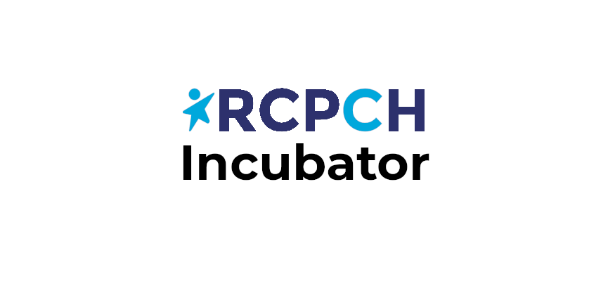

# RCPCH Health Inequalities App (codename LivingLens)

This was originally created as a partner app for the WHAM project. WHAM stands for Wellbeing and Health Action Movement.

WHAM was created by a small group of paediatricians to support other paediatricians to manage the social determinants of ill health seen in young patients and their families. More information on WHAM can be found [here](https://www.whamproject.co.uk/the-social)




## Getting Started

The RCPCH Health Inequalities App is a Flutter 3.3 project, written in Dart. Flutter is a mobile application development framework which allows us to develop in a single codebase and from this deploy native apps for iOS, Android, web and desktop.

## Local development setup

1. Download flutter and Dart with dependencies (iOS and Android SDKs) [here](https://docs.flutter.dev/get-started/install). You will need to create a virtual device to demo the app on, or connect a real device.

1. Clone this repository

```shell
git clone https://github.com/rcpch/rcpch-livinglens
```

```shell
cd rcpch-livinglens
```

1. Install dependencies

```shell
flutter pub get
```

1. Run the application (web browser)

```shell
flutter run
```

1. Run the application (Android emulator)

```shell
flutter emulators
1 available emulator:

Id                  • Name                • Manufacturer • Platform

Medium_Phone_API_36 • Medium Phone API 36 • Generic      • android

To run an emulator, run 'flutter emulators --launch <emulator id>'.
To create a new emulator, run 'flutter emulators --create [--name xyz]'.

You can find more information on managing emulators at the links below:
  https://developer.android.com/studio/run/managing-avds
  https://developer.android.com/studio/command-line/avdmanager

flutter emulators --launch Medium_Phone_API_36
```

You must wait until the emulator has booted up and is showing you the Android home screen.

```shell
flutter run
```

The first time you do this it will download all software build tools ever created so expect it to take ages.

The app has been tested on:

- iOS (@eatyourpeas)
- Android (@pacharanero)
- Linux Desktop (@pacharanero)


## Releases

- iOS
  - TODO
- Android
  - Pushing to the `main` branch (including merging PRs) automatically update the [internal testing release](https://play.google.com/apps/internaltest/4701570421814090962)
  - There is currently no beta or production release


## Some installation notes

- If your Dart SDK isn't the correct version (at the time of writing it needs to be >3) then you can run `flutter upgrade` to update both Flutter and Dart. For some reason this was even required on a new install of Flutter in one case.

- The Android Virtual Device Manager defaults to a very low amount of disk space for virtual Android devices, and quite often this disk space is insufficient to actually load an app into, causing failure of the app to run. There will be a 'not enough disk space' or similar error. To increase disk space, you can Edit the Virtual Device in Android Studio, select 'Advanced' and increase the device disk storage to something bigger.


## Troubleshooting

```
The Android emulator exited with code 1 during startup
Android emulator stderr:
Address these issues and try again.
```

Try cold booting the Emulator. Go to the Android Virtual Device Manager in Android Studio ("View" > "Device Manager") and select "Cold Boot".
